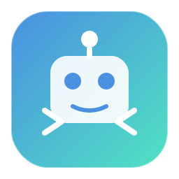

 <div align="center">
   
   <h1>AI Agent 学习懒人包</h1>
   12 个主题 · 可运行代码 · 中文文档 · <a href="https://tanzhijir-04.github.io/AI-Agent-Study/">在线知识库</a>
 </div>
 
 <div align="center">
 <a href="https://tanzhijir-04.github.io/AI-Agent-Study/"></a>
 <a href="https://ifdian.net/a/tanz666/plan"></a>
 <a href="https://space.bilibili.com/15586839"></a>
 </div>
 
 ## 这个仓库是做什么的
 
 做了一个 AI Agent 的学习仓库。
 
 从最基础的 Agent 循环（就是 AI 自己思考→调用工具→再思考的那个循环）开始，到 Memory、Multi-agent 协作、LangChain/LangGraph、MCP 协议这些更深入的东西，一路用代码推过去。每个主题都有中文文档、直接能跑的 JS/Python 代码、配套测试。
 
 代码不需要 GPU 或 API Key，装个 Node.js 就能跑。
 
 **谁会用得上：**
 
 | 如果你…… | 可以从这里下手 |
 |---|---|
 | 刚接触 Agent，想理解 AI Agent 是什么 | 看 [Plan Mode 文档](docs/tutorials/01-plan-mode/)，然后跟着跑代码 |
 | 写代码但没碰过 LLM 相关的开发 | [minimal_agent/](minimal_agent/) 下面的代码都是 Node.js 直接跑的 |
 | 主要用 Python | 翻 [LangChain/LangGraph 专题](docs/tutorials/12-langchain-langgraph/) 和 [Python 示例](minimal_agent/langchain/) |
 | 想拿这个当素材讲课 | [在线知识库](https://tanzhijir-04.github.io/AI-Agent-Study/) 直接打开就能当课件 |
 
 ## 在线知识库怎么用
 
 [https://tanzhijir-04.github.io/AI-Agent-Study/](https://tanzhijir-04.github.io/AI-Agent-Study/)
 
 仓库里的文档被渲染成了网页，在浏览器里切章节看就行，不用克隆仓库。每一章都包含概念讲解和可复制的代码块。
 
 我个人最推荐的方式：打开网页读文档理解概念，然后 git clone 到本地跑代码、改参数。代码都在 minimal_agent/ 下面，跑测试用 `.\minimal_agent\run_tests.ps1`。
 
 ## 学习路径
 
 这些路线是按实际依赖排的，箭头指向的方向需要先学前面的内容。
 
 **入门 — 把 Agent 跑起来**
 
 ```
 Plan Mode → Memory 系统 → Loop/Workflow
 ```
 
 **架构 — 理解 Agent 内部**
 
 ```
 上下文压缩 → Multi-agent → Sandbox → MCP
 ```
 
 **扩展开发 — 给 Agent 加能力**
 
 ```
 Skills/Plugins → Sandbox → MCP
 ```
 
 **LLM 框架 — 用 Python 写正经应用**
 
 ```
 Plan Mode → Memory → Multi-agent → Loop/Workflow → LangChain/LangGraph
 ```
 
 拿不准从哪开始的，先看[教程总览文档](docs/tutorials/README.md)，里面有一张依赖关系图。
 
 ## 极速开始
 
 ```bash
 git clone https://github.com/tanzhijir-04/AI-Agent-Study.git
 cd AI-Agent-Study
 
 node minimal_agent/agent.js
 
 # Windows
 .\minimal_agent\run_tests.ps1
 
 # Python
 cd minimal_agent
 python langchain/basic_chain.py
 ```
 
 ## 项目骨架
 
 ```
 AI-Agent-Study/
 ├── docs/
 │   ├── INDEX.md            # 文档索引
 │   └── tutorials/          # 12 章教程
 ├── minimal_agent/
 │   ├── agent.js            # 基础 Agent
 │   ├── agent_v2.js         # 带 Memory 的 v2
 │   ├── plan_mode.js        # Plan Mode
 │   ├── multi_agent_system.js
 │   ├── loop_control.js + workflow_engine.js
 │   ├── langchain/          # Python 示例
 │   ├── demos/
 │   └── tests/
 └── asset/
     └── icon.svg
 ```
 
 完整结构在 [AGENTS.md](AGENTS.md)。
 
 ## 学习进度
 
 | 章节 | 状态 | 核心代码 | 测试 |
 |---|---|---|---|
 | Plan Mode | ✅ | plan_mode.js 两个版本 | ✅ |
 | Memory 系统 | ✅ | memory.js, agent_v2.js | ✅ |
 | 上下文压缩 | ✅ | demos/demo_context_compression.js | — |
 | Multi-agent | ✅ | multi_agent_system.js 等 | ✅ |
 | 后台任务 | 📅 | — | — |
 | Skills/Plugins | ✅ | skill_system.js, plugin_system.js | ✅ |
 | Loop/Workflow | ✅ | loop_control.js, workflow_engine.js | ✅ |
 | Sandbox | 🔄 编写中 | — | — |
 | MCP | 🔄 编写中 | — | — |
 | TUI | 🔄 编写中 | — | — |
 | 可视化 | 🔄 编写中 | — | — |
 | LangChain/LangGraph | 🔄 编写中 | langchain/ 下三个示例 | — |
 
 ✅ 已完成 · 🔄 编写中 · 📅 待开始
 
 ## 推荐资源
 
 - [Claude Code 文档](https://docs.anthropic.com/claude-code)
 - [OpenAI Codex 文档](https://platform.openai.com/docs/codex)
 - [MCP 协议](https://modelcontextprotocol.io)
 - [LangChain 文档](https://python.langchain.com/)
 - [LangGraph 文档](https://langchain-ai.github.io/langgraph/)
 
 ---
 
 <div align="center">
 
 有问题开 Issue，想一起写发 PR。<br>
 <a href="https://space.bilibili.com/15586839">B站主页</a> · <a href="https://ifdian.net/a/tanz666/plan">爱发电赞助</a> · <a href="https://tanzhijir-04.github.io/AI-Agent-Study/">在线知识库</a>
 
 </div>
 
 *2026年7月15日*
