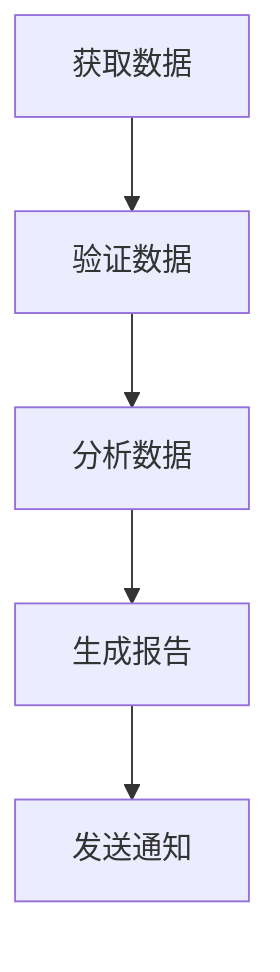

# Loop/Workflow控制 - 完整学习指南

> 防止无限循环、管理执行流程、构建可靠的工作流 ✅ 已完成（2026年7月14日）

## 📚 目录

1. [为什么需要Loop/Workflow控制](#为什么需要loopworkflow控制)
2. [核心概念](#核心概念)
3. [循环控制（LoopController）](#1-循环控制-loopcontroller)
4. [重试策略（RetryStrategy）](#2-重试策略-retrystrategy)
5. [断路器（CircuitBreaker）](#3-断路器-circuitbreaker)
6. [速率限制器（RateLimiter）](#4-速率限制器-ratelimiter)
7. [状态机（StateMachine）](#5-状态机-statemachine)
8. [工作流引擎（WorkflowEngine）](#6-工作流引擎-workflowengine)
9. [组合使用示例](#组合使用示例)
10. [最佳实践](#最佳实践)

---

## 为什么需要Loop/Workflow控制

AI Agent在自主执行任务时，面临几个关键挑战：

### 1. 无限循环风险
Agent在执行任务时，如果没有适当的控制机制，可能陷入无限循环。例如：

- **调试循环**：代码出错 → 重试 → 修复 → 还有错 → 重试...
- **搜索循环**：找不到答案 → 扩大搜索 → 找不到 → 换个方式搜...
- **优化循环**：不够好 → 再优化 → 还不满意 → 继续优化...

### 2. 资源耗尽
Agent可能消耗过多资源：
- 无限重试导致API费用激增
- 频繁请求导致服务端限流
- 内存泄漏或堆积

### 3. 执行流程不可控
没有工作流引擎时，任务执行难以：
- 跟踪进度
- 处理依赖关系
- 并行执行
- 条件分支

### 4. 故障传播
一个环节出错可能导致整个任务失败：
- 需要优雅的重试机制
- 需要断路器防止雪崩
- 需要降级策略

---

## 核心概念

| 概念 | 解决的问题 | 类比 |
|------|-----------|------|
| 循环控制 | 防止无限循环，限制资源消耗 | 微波炉定时器 |
| 重试策略 | 临时故障自动恢复 | 电话占线重拨 |
| 断路器 | 防止级联故障 | 电路跳闸 |
| 速率限制 | 控制请求频率 | 水龙头阀门 |
| 状态机 | 管理有限状态转换 | 电梯控制 |
| 工作流引擎 | 编排多步骤任务 | 工厂流水线 |

---

## 1. 循环控制器（LoopController）

### 用途
控制Agent主循环的执行，防止无限迭代。

### 配置选项

```javascript
var loop = new LoopController({
  maxIterations: 100,     // 最大迭代次数
  timeout: 30000,         // 超时时间（毫秒）
  breakCondition: null,   // 提前中断条件函数
  onProgress: null        // 进度回调
});
```

### 关键方法

| 方法 | 说明 |
|------|------|
| `run(iterationFn)` | 执行循环，每次调用iterationFn |
| `pause()` | 暂停循环 |
| `resume()` | 恢复循环 |
| `getStatus()` | 获取当前状态 |
| `reset()` | 重置控制器 |

### 使用示例

```javascript
// 逐步逼近目标值，达到精度后提前退出
var loop = new LoopController({
  maxIterations: 100,
  timeout: 10000,
  breakCondition: function(result) {
    return Math.abs(result - target) < 0.01;
  }
});

var result = await loop.run(async function(iteration, previous) {
  var guess = computeNextGuess(previous);
  return guess;
});

console.log("Completed: " + result.reason); // "completed" | "break_condition" | "timeout"
console.log("Iterations: " + result.iterations);
```

### 返回结果

```javascript
{
  success: true,           // 是否成功完成
  reason: "completed",     // 结束原因：completed | break_condition | timeout
  message: "Completed 5 iterations",
  iterations: 5,
  results: [1, 2, 3, 4, 5] // 每次迭代的结果
}
```

---

## 2. 重试策略（RetryStrategy）

### 用途
当操作失败时，自动重试，支持多种退避策略。

### 配置选项

```javascript
var retry = new RetryStrategy({
  maxRetries: 3,           // 最大重试次数
  baseDelay: 1000,         // 基础延迟（毫秒）
  maxDelay: 30000,         // 最大延迟（毫秒）
  backoffType: "exponential", // 退避类型：fixed | linear | exponential
  retryCondition: function(error, attempt) {
    return error.code !== 400; // 只在非客户端错误时重试
  },
  onRetry: function(info) {
    console.log("Retrying: attempt " + info.attempt);
  }
});
```

### 退避策略对比

| 类型 | 延迟计算 | 特点 |
|------|---------|------|
| `fixed` | baseDelay | 恒定延迟，适合固定限流窗口 |
| `linear` | baseDelay × attempt | 线性增长，温和退避 |
| `exponential` | baseDelay × 2^(attempt-1) + jitter | 指数增长，快速退避（默认） |

**Jitter（随机抖动）**：指数退避增加10%随机抖动，防止重试风暴（多个客户端同时重试导致服务器负载飙升）。

### 使用示例

```javascript
var strategy = new RetryStrategy({
  maxRetries: 3,
  baseDelay: 500,
  backoffType: "exponential",
  retryCondition: function(err) {
    return err.message.includes("timeout") || err.message.includes("rate");
  }
});

var result = await strategy.execute(async function(attempt) {
  return await callExternalAPI();
});

if (result.success) {
  console.log("Succeeded after " + result.attempts + " attempts");
} else {
  console.log("Failed: " + result.error);
}
```

---

## 3. 断路器（CircuitBreaker）

### 用途
防止对故障服务的连续调用，让服务有时间恢复。

### 状态机

```
         ┌──────────┐
         │  CLOSED  │  ← 正常状态，请求直接通过
         └────┬─────┘
              │ 失败达到阈值
              ▼
         ┌──────────┐
         │   OPEN   │  ← 拒绝所有请求，等待超时
         └────┬─────┘
              │ 超时后
              ▼
         ┌──────────┐
         │ HALF-OPEN│  ← 允许探测请求
         └────┬─────┘
       ┌──────┴──────┐
       ▼              ▼
  成功(回到CLOSED)  失败(回到OPEN)
```

### 配置选项

```javascript
var breaker = new CircuitBreaker({
  failureThreshold: 5,     // 失败阈值（默认5）
  successThreshold: 2,     // 半开状态恢复阈值（默认2）
  openTimeout: 30000,      // 开路超时（毫秒）
  halfOpenTimeout: 10000,  // 半开超时（毫秒）
  onStateChange: function(change) {
    // monitor state transitions
  }
});
```

### 使用示例

```javascript
var breaker = new CircuitBreaker({
  failureThreshold: 3,
  openTimeout: 5000
});

for (var i = 0; i < 10; i++) {
  try {
    var result = await breaker.call(async function() {
      return await unreliableService();
    });
    console.log("Success:", result);
  } catch (e) {
    console.log("Failed:", e.message);
  }
}
```

---

## 4. 速率限制器（RateLimiter）

### 用途
控制请求频率，防止超出API限制。

### 令牌桶算法

```
   ┌─────────────────────┐
   │   令牌桶 (Bucket)    │  ← 以固定速率添加令牌
   │  最大容量: 100       │
   │  当前: 73            │
   └────────┬────────────┘
            │
    ┌───────┴───────┐
    │   请求队列      │  ← 按优先级排序
    │   [高] [中] [低]│
    └───────────────┘
```

### 配置选项

```javascript
var limiter = new RateLimiter({
  tokensPerSecond: 10,     // 每秒生成的令牌数
  bucketSize: 100,         // 令牌桶容量（允许突发）
  maxQueueSize: 500        // 最大队列长度
});
```

### 使用示例

```javascript
var limiter = new RateLimiter({
  tokensPerSecond: 5,      // 每秒5个请求
  bucketSize: 10           // 可突发10个请求
});

// 高优先级请求
limiter.schedule(async function() {
  return await criticalOperation();
}, { priority: "high", timeout: 5000 });

// 普通请求（令牌不足时排队等待）
limiter.schedule(async function() {
  return await normalOperation();
}, { timeout: 10000 });

// 非阻塞请求（令牌不足时直接拒绝）
try {
  await limiter.schedule(async function() {
    return await optionalOperation();
  }, { timeout: 0 });
} catch (e) {
  // handle rate limit
}
```

---

## 5. 状态机（StateMachine）

### 用途
管理Agent的生命周期和状态转换。

### 配置选项

```javascript
var sm = new StateMachine({
  initialState: "idle",
  states: {
    "idle": {
      transitions: { start: "running" },
      onEnter: function(ctx) { /* 进入状态时执行 */ },
      onLeave: function(ctx, data) { /* 离开状态时执行 */ }
    },
    "running": {
      transitions: {
        complete: { target: "done", guard: function(ctx) { return ctx.ready; } },
        fail: "error"
      }
    },
    "done": { transitions: {} },
    "error": { transitions: { retry: "running" } }
  },
  onTransition: function(from, to, event, data) {
    console.log(from + " -> " + to + " via " + event);
  }
});
```

### 守卫条件（Guard）

```javascript
// 只有满足条件时才允许转换
"approve": {
  target: "approved",
  guard: function(ctx) {
    return ctx.userRole === "admin" && ctx.amount < 10000;
  }
}
```

### 使用示例

```javascript
// 订单处理状态机
var order = new StateMachine({
  initialState: "pending",
  states: {
    "pending": {
      transitions: { confirm: "confirmed", cancel: "cancelled" }
    },
    "confirmed": {
      transitions: {
        ship: { target: "shipping", guard: function(ctx) { return ctx.paymentReceived; } },
        cancel: "cancelled"
      }
    },
    "shipping": { transitions: { deliver: "delivered" } },
    "delivered": { transitions: {} },
    "cancelled": { transitions: {} }
  }
});

order.setContext("paymentReceived", true);
order.trigger("confirm");  // pending -> confirmed
order.trigger("ship");     // confirmed -> shipping (guarded)
```

---

## 6. 工作流引擎（WorkflowEngine）

### 用途
编排多步骤、有依赖关系的任务执行。

### DAG工作流



### 配置选项

```javascript
var workflow = new WorkflowEngine("pipeline", {
  maxConcurrency: 5,           // 最大并行节点数
  onNodeComplete: function(r) {
    console.log(r.nodeId + ": " + (r.success ? "OK" : "FAIL"));
  },
  onWorkflowComplete: function(r) {
    console.log("Workflow " + r.name + " " + r.status);
  }
});
```

### 节点配置

```javascript
workflow.addNode("task-id", {
  name: "任务名称",
  execute: async function(context) {
    // 执行逻辑，结果可存入context
    context.result = await process();
    return context.result;
  },
  dependsOn: ["previous-task"],  // 依赖的前置任务
  options: {
    timeout: 5000,               // 节点超时
    retries: 2,                  // 节点重试次数
    condition: function(ctx) {   // 条件执行
      return ctx.shouldProcess;
    }
  }
});
```

### 批量添加节点

```javascript
workflow.addNodes({
  "step1": { execute: async function(ctx) {}, options: {} },
  "step2": { execute: async function(ctx) {}, dependsOn: ["step1"] },
  "step3": { execute: async function(ctx) {}, dependsOn: ["step1"] },
  "step4": { execute: async function(ctx) {}, dependsOn: ["step2", "step3"] }
});
```

### 完整示例

```javascript
var pipeline = new WorkflowEngine("data-pipeline");

pipeline.addNodes({
  "fetch": {
    name: "获取数据",
    execute: async function(ctx) {
      ctx.data = await fetchData();
    }
  },
  "process": {
    name: "处理数据",
    execute: async function(ctx) {
      ctx.result = transform(ctx.data);
    },
    dependsOn: ["fetch"]
  },
  "save": {
    name: "保存结果",
    execute: async function(ctx) {
      await saveToDB(ctx.result);
    },
    dependsOn: ["process"],
    options: { timeout: 10000 }
  }
});

var result = await pipeline.run();

if (result.success) {
  console.log("Pipeline completed");
} else {
  console.log("Pipeline failed:", result.reason);
}
```

### Mermaid可视化

工作流引擎内置 `toMermaid()` 方法，可直接生成流程图：

```javascript
console.log(workflow.toMermaid());
// 输出：
// graph TD;
//   fetch[获取数据]
//   fetch-->process
//   process-->save
```

---

## 组合使用示例

### 稳定的API调用模式

```javascript
// 组合：速率限制 + 断路器 + 重试
async function stableAPICall(request) {
  // 1. 速率限制：控制请求频率
  return await rateLimiter.schedule(async function() {

    // 2. 断路器：防止连续故障
    return await circuitBreaker.call(async function() {

      // 3. 重试策略：处理临时故障
      var result = await retryStrategy.execute(async function() {
        return await apiClient.call(request);
      });

      if (!result.success) {
        throw new Error(result.error);
      }
      return result.result;
    });
  }, { timeout: 10000 });
}
```

### Agent主循环控制

```javascript
// 组合：循环控制 + 重试 + 速率限制
async function agentMainLoop() {
  var controller = new LoopController({
    maxIterations: 50,
    timeout: 300000,  // 5 minutes
    breakCondition: function(result) {
      return result.status === "completed";
    }
  });

  return await controller.run(async function(iteration) {
    // 每次迭代：处理一个任务
    var task = await getNextTask();

    var strategy = new RetryStrategy({
      maxRetries: 2,
      baseDelay: 1000
    });

    var result = await strategy.execute(function() {
      return executeTask(task);
    });

    return result.success ? { status: "completed" } : { status: "retry" };
  });
}
```

---

## 最佳实践

### 1. 选择合适的上限

```javascript
// 循环上限
var loop = new LoopController({ maxIterations: 100 });
// 重试上限
var retry = new RetryStrategy({ maxRetries: 3 });
// 断路上限
var breaker = new CircuitBreaker({ failureThreshold: 5 });
// 速率上限
var limiter = new RateLimiter({ tokensPerSecond: 10, bucketSize: 20 });
```

### 2. 优雅降级

```javascript
try {
  return await breaker.call(async function() {
    return await expensiveOperation();
  });
} catch (e) {
  // 降级到缓存或简化处理
  return getCachedResult();
}
```

### 3. 监控和日志

```javascript
var loop = new LoopController({
  onProgress: function(info) {
    metrics.record("loop.iteration", info.iteration);
    metrics.record("loop.elapsed", info.elapsed);
  }
});

var breaker = new CircuitBreaker({
  onStateChange: function(change) {
    logger.warn("Circuit state changed", change);
  }
});
```

### 4. 选择合适的退避策略

| 场景 | 推荐策略 |
|------|---------|
| API限流 (429) | exponential + jitter |
| 数据库连接失败 | fixed |
| 网络超时 | exponential |
| 文件系统操作 | linear |

### 5. 工作流设计原则

- **节点幂等性**：每个节点应可安全重试
- **上下文隔离**：节点间通过context通信，避免全局状态
- **超时设置**：为每个节点设置合理的超时
- **失败处理**：关键路径上的节点实现降级策略

### 6. 避免的问题

```
❌ 无限制重试 -> 资源耗尽
✅ 设置maxRetries + 指数退避

❌ 所有请求同时重试 -> 重试风暴
✅ 添加jitter随机抖动

❌ 失败后立即重试 -> 仍会失败
✅ 使用断路器进行等待

❌ 突发大量请求 -> 服务限流
✅ 使用速率限制器
```

---

## 测试结果

| 测试文件 | 测试数 | 通过 |
|---------|--------|------|
| test_loop_control.js | 28 | 28 |
| test_workflow_engine.js | 10 | 10 |
| **合计** | **38** | **38** |

## 快速开始

```bash
# 运行演示
node minimal_agent/demos/demo_loop_control.js

# 运行测试
node minimal_agent/tests/test_loop_control.js
node minimal_agent/tests/test_workflow_engine.js

# 独立运行模块
node minimal_agent/loop_control.js
node minimal_agent/workflow_engine.js
```

---

## 下一步学习

1. 研究分布式工作流引擎（如 Temporal, Airflow）
2. 实现更复杂的调度策略（如 CRON, 优先级队列）
3. 集成外部监控系统（如 Prometheus, Grafana）
4. 探索事件驱动架构（如 Event Sourcing, CQRS）

---

*指南完成时间：2026年7月14日*
