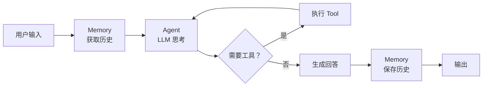

# LangChain 核心组件：Memory、RAG、Tool、Agent

> 适合读者：已掌握 Chain/Prompt/LLM 基本用法，想知道怎么构建真正的应用

---

## 1. Memory — 让 Agent 记住对话

### 为什么需要 Memory？

LLM 本身是**无状态**的。每次调用都是独立的，它不知道之前说过什么。

```python
# 问题
chain.invoke({"question": "我叫小明"})
chain.invoke({"question": "我叫什么名字？"})  # 它不知道！
```

### 最简单的 Memory：ConversationBufferMemory

```python
from langchain.memory import ConversationBufferMemory

memory = ConversationBufferMemory()
memory.chat_memory.add_user_message("我叫小明")
memory.chat_memory.add_ai_message("你好小明！")

# memory 里现在存了两条消息
```

### 但在 Chain 里怎么用？

实际中你需要用 `RunnableWithMessageHistory` 来给 Chain 挂载 Memory：

```python
from langchain_core.prompts import ChatPromptTemplate, MessagesPlaceholder
from langchain_openai import ChatOpenAI
from langchain_core.runnables import RunnableWithMessageHistory
from langchain.memory import ChatMessageHistory

prompt = ChatPromptTemplate.from_messages([
    ("system", "你是一个乐于助人的助手。"),
    MessagesPlaceholder(variable_name="history"),  # 历史消息占位
    ("user", "{input}")
])

llm = ChatOpenAI(model="gpt-4")
chain = prompt | llm

# 用 RunnableWithMessageHistory 包装
chain_with_memory = RunnableWithMessageHistory(
    chain,
    lambda session_id: ChatMessageHistory(),  # 按 session_id 取历史
    input_messages_key="input",
    history_messages_key="history"
)

config = {"configurable": {"session_id": "user-123"}}

# 第一次对话
resp1 = chain_with_memory.invoke(
    {"input": "我叫小明"},
    config=config
)

# 第二次对话 — Agent 还记得！
resp2 = chain_with_memory.invoke(
    {"input": "我叫什么名字？"},
    config=config
)
print(resp2.content)  # 你叫小明！
```

### Memory 的类型

| 类型 | 行为 | 适合场景 |
|------|------|---------|
| `ConversationBufferMemory` | 存所有历史 | 短对话 |
| `ConversationSummaryMemory` | LLM 自动总结历史 | 长对话，token 敏感 |
| `ConversationBufferWindowMemory` | 只保留最近 K 轮 | 资源有限 |
| `VectorStoreRetrieverMemory` | 用向量搜索相关历史 | 超长记忆，需要检索 |

对比你之前写的 `memory.js`：你的实现类似于 `ConversationBufferMemory`，
但 LangChain 提供了更多策略来应对不同的 token 预算和场景。

---

## 2. RAG — 让 Agent 了解你的知识

### RAG 是什么？

RAG = Retrieval Augmented Generation（检索增强生成）。

核心思想：**不要靠 LLM 记住你的数据，而是把数据检索出来塞进 prompt**。

```
用户提问 ──→ 向量搜索 ──→ 找到相关文档
                              │
                              ▼
           LLM + (问题 + 文档) ──→ 基于事实的回答
```

### 四个步骤

#### 第一步：加载文档
```python
from langchain_community.document_loaders import TextLoader, WebBaseLoader

# 从文件加载
loader = TextLoader("knowledge.txt")
docs = loader.load()

# 从网页加载
web_loader = WebBaseLoader("https://example.com/docs")
web_docs = web_loader.load()
```

#### 第二步：切分文档
```python
from langchain.text_splitter import RecursiveCharacterTextSplitter

splitter = RecursiveCharacterTextSplitter(
    chunk_size=1000,     # 每段约 1000 字符
    chunk_overlap=200,   # 前后重叠 200 字符（保持上下文连贯）
)
chunks = splitter.split_documents(docs)
```

#### 第三步：向量化 + 存入向量库
```python
from langchain_openai import OpenAIEmbeddings
from langchain_community.vectorstores import Chroma

embeddings = OpenAIEmbeddings(model="text-embedding-3-small")
vectorstore = Chroma.from_documents(
    documents=chunks,
    embedding=embeddings,
    persist_directory="./chroma_db"
)
```

#### 第四步：检索 + 回答
```python
from langchain_core.runnables import RunnablePassthrough

# 创建检索器
retriever = vectorstore.as_retriever(search_kwargs={"k": 3})

# 模板：把检索到的文档塞进 prompt
rag_prompt = ChatPromptTemplate.from_messages([
    ("system", "你是一个问答助手。根据以下上下文回答问题。"
               "如果上下文中找不到答案，就说不知道。"),
    ("user", "上下文：{context}\n\n问题：{question}")
])

# 完整的 RAG Chain
rag_chain = (
    {"context": retriever, "question": RunnablePassthrough()}
    | rag_prompt
    | llm
    | StrOutputParser()
)

result = rag_chain.invoke("AI Agent 有哪些特性？")
```

**关键理解**：`retriever` 在这里是一个 Runnable，它自动把输入的问题拿去向量搜索，
返回相关文档列表。LCEL 会自动处理格式转换。

### 你在项目中的对应

你之前做的 `memory.js` + 文件读取功能 ≈ 一个手写的 RAG 系统，只不过 LangChain
把向量化、检索、分块这些步骤都封装好了，你只需要配置参数。

---

## 3. Tool — 让 LLM 使用外部能力

### 为什么需要 Tool？

LLM 本身只能"说话不能做事"。它不能：
- 查数据库
- 发 HTTP 请求
- 计算数学
- 操作文件

**Tool（工具）让 LLM 可以调用外部函数**。底层用的是 function calling API。

### 定义工具

```python
from langchain_core.tools import tool

@tool
def calculate(expression: str) -> str:
    """计算数学表达式，如 '2 + 3 * 4'"""
    try:
        result = eval(expression)
        return f"结果：{result}"
    except Exception as e:
        return f"计算错误：{e}"

@tool
def get_weather(city: str) -> str:
    """查询某个城市的天气"""
    # 这里假装调用天气 API
    return f"{city}今天的天气是晴天，25°C"
```

### 给 LLM 绑定工具

```python
tools = [calculate, get_weather]
llm_with_tools = llm.bind_tools(tools)

response = llm_with_tools.invoke("北京天气怎么样？")
# LLM 会返回一个 tool_call，而不是直接回答
print(response.tool_calls)
# [{'name': 'get_weather', 'args': {'city': '北京'}, 'id': 'call_xxx'}]
```

### 手动执行工具调用

Tool 的 `invoke` 是**你（代码）来调用的**，不是 LLM 自己调用的。
LLM 只是决定"该用什么工具、传什么参数"，真正的执行在你的代码里。

```python
tool_map = {tool.name: tool for tool in tools}

for tool_call in response.tool_calls:
    tool_fn = tool_map[tool_call["name"]]
    result = tool_fn.invoke(tool_call["args"])
    print(f"{tool_call['name']}({tool_call['args']}) = {result}")
```

---

## 4. Agent — 自动决定做什么

### Agent vs Chain 的区别

```
Chain：   你定义每一步的顺序，LLM 只负责生成文本
Agent：   LLM 自己决定每一步做什么（思考 → 行动 → 观察 → 再思考）
```

Agent 的核心就是**循环**：

```
用户输入
  │
  ▼
思考（Think）：LLM 决定下一步做什么
  │
  ▼
行动（Act）：调用工具或回答
  │
  ▼
观察（Observe）：工具返回结果
  │
  ▼
循环，直到 LLM 决定可以回答了
```

这个循环就是经典的 **ReAct**（Reasoning + Acting）模式。

### 用 LangChain 创建 Agent

```python
from langchain.agents import create_tool_calling_agent, AgentExecutor

# 创建 Agent（LLM + 提示 + 工具）
agent = create_tool_calling_agent(llm, tools, agent_prompt)

# Agent Executor 负责运行循环
agent_executor = AgentExecutor(
    agent=agent,
    tools=tools,
    verbose=True,      # 打印思考过程
    max_iterations=10  # 防止无限循环
)

result = agent_executor.invoke({
    "input": "先算 2+3*4，然后查北京的天气"
})
```

Agent 会：
1. 意识到要分两步
2. 先调用 `calculate("2 + 3 * 4")` → 得到 14
3. 再调用 `get_weather("北京")` → 得到晴天
4. 综合回答

**这和你的 multi_agent_system.js 里 Master Agent 分发任务很像**，
只不过这里是一个 Agent 自己决定工具调用顺序，而不是由调度器分配。

---

## 5. 整个流程放一起看



---

## 6. 下集预告

现在你理解了 Memory、RAG、Tool 和 Agent。但这里有个问题：
**Agent 的循环是 LangChain 内部写死的**，你不容易自定义流程、加条件判断、
插入人工审核、做状态持久化。

这就是 **LangGraph** 出场的原因。

下一课 [03-langgraph-intro.md](03-langgraph-intro.md) 讲：
- StateGraph — 用有向图定义 Agent 行为
- Node — 每个步骤是一个节点
- Edge — 条件跳转和循环

---

*文档更新时间：2026年7月14日*
