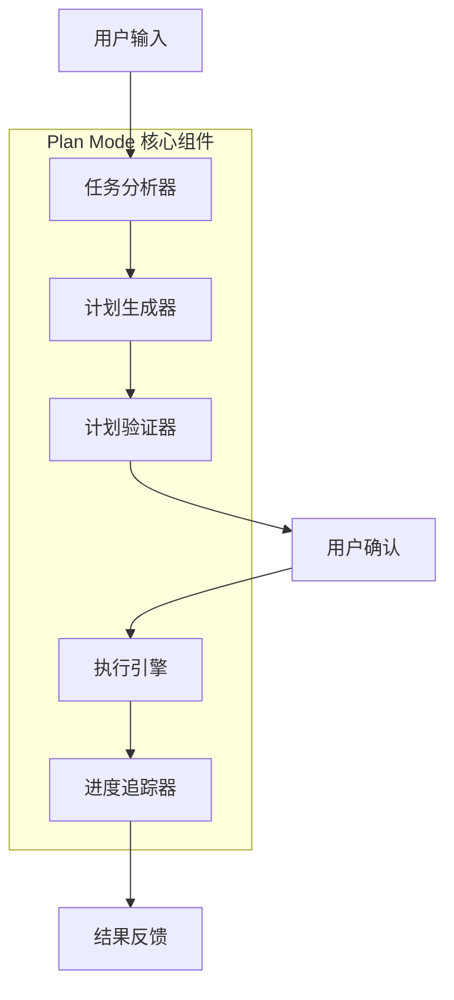

# 🔍 Codex Plan Mode 实现分析

## 1. 概述

Codex 是 OpenAI 开发的命令行编码代理，其 Plan Mode 是核心特性之一。该模式允许 Agent 在执行复杂任务前先制定计划，然后按照计划逐步执行。

## 2. 架构设计

### 2.1 核心组件



### 2.2 数据流

```
用户请求 → 上下文收集 → 任务分解 → 计划生成 → 计划优化 → 用户确认 → 执行 → 反馈
```

## 3. 关键实现细节

### 3.1 计划数据结构

Codex 使用结构化的计划数据格式：

```typescript
interface Plan {
  id: string;
  description: string;
  steps: PlanStep[];
  metadata: {
    createdAt: Date;
    estimatedDuration: string;
    complexity: 'low' | 'medium' | 'high';
    requiredTools: string[];
  };
  status: 'draft' | 'approved' | 'executing' | 'completed' | 'failed';
}

interface PlanStep {
  id: string;
  action: string;
  description: string;
  estimatedTime: string;
  dependencies: string[];  // 依赖的其他步骤ID
  tools: string[];         // 需要的工具
  risks: string[];         // 潜在风险
  successCriteria: string; // 成功标准
  status: 'pending' | 'in_progress' | 'completed' | 'failed' | 'skipped';
}
```

### 3.2 计划生成算法

Codex 的计划生成遵循以下算法：

```python
def generate_plan(user_request, context):
    # 1. 任务分析
    analysis = analyze_task(user_request, context)
    
    # 2. 任务分解
    subtasks = decompose_task(analysis)
    
    # 3. 依赖分析
    dependencies = analyze_dependencies(subtasks)
    
    # 4. 资源需求评估
    resource_needs = assess_resource_needs(subtasks)
    
    # 5. 风险评估
    risks = assess_risks(subtasks, context)
    
    # 6. 计划优化
    optimized_plan = optimize_plan(subtasks, dependencies, risks)
    
    # 7. 添加元数据
    plan_with_metadata = add_metadata(optimized_plan, analysis)
    
    return plan_with_metadata
```

### 3.3 用户交互机制

Codex 的 Plan Mode 提供丰富的用户交互：

```
┌─────────────────────────────────────────┐
│          Codex Plan Mode               │
├─────────────────────────────────────────┤
│ 📋 计划：重构用户认证模块              │
│ ⏱️ 预估时间：45分钟                    │
│ 📊 复杂度：中等                        │
├─────────────────────────────────────────┤
│ 步骤 1: 分析现有代码结构               │
│   ⏱️ 时间：8分钟                       │
│   🔧 工具：read_file, analyze_code     │
│   ⚠️ 风险：可能遗漏依赖关系           │
│   ✅ 成功标准：识别所有认证相关文件    │
├─────────────────────────────────────────┤
│ 步骤 2: 设计新架构                     │
│   ⏱️ 时间：12分钟                      │
│   🔧 工具：write_file, diagram         │
│   📝 依赖：步骤1                       │
│   ⚠️ 风险：架构设计可能不完整         │
│   ✅ 成功标准：生成完整的架构图        │
├─────────────────────────────────────────┤
│ 步骤 3: 实现核心功能                   │
│   ⏱️ 时间：20分钟                      │
│   🔧 工具：write_file, test            │
│   📝 依赖：步骤2                       │
│   ⚠️ 风险：实现可能有bug             │
│   ✅ 成功标准：通过所有测试用例        │
├─────────────────────────────────────────┤
│ [批准执行] [修改计划] [取消]           │
└─────────────────────────────────────────┘
```

## 4. 技术实现亮点

### 4.1 智能任务分解

Codex 使用 LLM 进行智能任务分解：

```python
def decompose_task(analysis):
    prompt = f"""
    请将以下任务分解为具体的执行步骤：
    
    任务：{analysis.description}
    上下文：{analysis.context}
    约束条件：{analysis.constraints}
    
    要求：
    1. 每个步骤应该是原子性的
    2. 步骤之间应该有清晰的依赖关系
    3. 每个步骤应该有明确的成功标准
    4. 考虑潜在的风险和回滚方案
    
    请以JSON格式返回步骤列表。
    """
    
    response = call_llm(prompt)
    return parse_steps(response)
```

### 4.2 动态计划调整

Codex 支持在执行过程中动态调整计划：

```python
def execute_plan_with_adaptation(plan):
    for step in plan.steps:
        try:
            # 执行步骤
            result = execute_step(step)
            
            # 验证结果
            if not validate_result(step, result):
                # 计划需要调整
                adjusted_plan = adjust_plan(plan, step, result)
                return execute_plan_with_adaptation(adjusted_plan)
            
            # 更新进度
            update_progress(step, result)
            
        except Exception as e:
            # 错误处理
            handle_error(step, e)
            
            # 尝试恢复
            recovery_plan = create_recovery_plan(plan, step, e)
            return execute_plan_with_adaptation(recovery_plan)
    
    return plan
```

### 4.3 上下文感知

Codex 的 Plan Mode 具有上下文感知能力：

```python
def generate_context_aware_plan(user_request):
    # 收集上下文信息
    context = {
        'current_directory': get_current_directory(),
        'file_structure': scan_file_structure(),
        'git_status': get_git_status(),
        'recent_changes': get_recent_changes(),
        'project_type': detect_project_type(),
        'dependencies': analyze_dependencies()
    }
    
    # 基于上下文生成计划
    plan = generate_plan(user_request, context)
    
    # 根据上下文优化计划
    optimized_plan = optimize_based_on_context(plan, context)
    
    return optimized_plan
```

## 5. 用户体验设计

### 5.1 计划展示

Codex 使用清晰的界面展示计划：

```
🤖 Codex Plan Mode

📝 任务：为项目添加单元测试
⏱️ 预估时间：35分钟
📊 复杂度：低
🔧 所需工具：read_file, write_file, run_test

📋 执行计划：
━━━━━━━━━━━━━━━━━━━━━━━━━━━━━━━━━━━━━━━━━━

1️⃣ 分析现有代码结构
   ⏱️ 5分钟 | 🔧 read_file | ⚠️ 低风险
   
2️⃣ 识别需要测试的函数
   ⏱️ 8分钟 | 🔧 analyze_code | ⚠️ 低风险
   📝 依赖：步骤1
   
3️⃣ 设计测试用例
   ⏱️ 12分钟 | 🔧 design_test | ⚠️ 中风险
   📝 依赖：步骤2
   
4️⃣ 实现测试代码
   ⏱️ 15分钟 | 🔧 write_file | ⚠️ 中风险
   📝 依赖：步骤3
   
5️⃣ 运行测试验证
   ⏱️ 5分钟 | 🔧 run_test | ⚠️ 低风险
   📝 依赖：步骤4

━━━━━━━━━━━━━━━━━━━━━━━━━━━━━━━━━━━━━━━━━━

❓ 是否批准此计划？
[✅ 批准] [✏️ 修改] [❌ 取消]
```

### 5.2 执行监控

执行过程中的实时监控：

```
🔄 执行中：步骤 3/5 - 设计测试用例

进度：████████░░░░░░░░░░░░ 60%
时间：已用 18分钟 / 预估 35分钟

当前操作：分析函数参数和返回值
✅ 已完成：识别 12 个需要测试的函数
📝 待完成：设计测试用例

[暂停] [取消] [查看详情]
```

## 6. 与传统执行模式的对比

### 6.1 传统模式（无Plan Mode）

```
用户请求 → 直接执行 → 可能出错 → 重新执行 → 完成
```

**问题**：
- 缺乏整体规划
- 容易遗漏重要步骤
- 错误难以恢复
- 用户无法预知执行过程

### 6.2 Plan Mode

```
用户请求 → 制定计划 → 用户确认 → 按计划执行 → 实时反馈 → 完成
```

**优势**：
- 全局视野，步骤清晰
- 用户可控，可修改计划
- 错误预防，风险可控
- 进度透明，体验良好

## 7. 实际案例分析

### 案例1：代码重构

**用户请求**：重构这个React组件，使其更易维护

**Codex Plan Mode 执行**：

```
📋 计划：重构React组件
⏱️ 预估时间：25分钟

步骤1：分析组件结构（5分钟）
  - 读取组件文件
  - 识别复杂度和问题
  - 分析依赖关系

步骤2：设计重构方案（8分钟）
  - 分离关注点
  - 提取子组件
  - 优化状态管理

步骤3：实施重构（10分钟）
  - 创建新组件结构
  - 迁移逻辑
  - 更新导入

步骤4：测试验证（2分钟）
  - 运行现有测试
  - 手动测试功能
  - 检查性能

[批准执行]
```

### 案例2：添加新功能

**用户请求**：为这个API添加用户认证功能

**Codex Plan Mode 执行**：

```
📋 计划：添加用户认证功能
⏱️ 预估时间：45分钟
⚠️ 风险：中等（涉及安全相关代码）

步骤1：分析现有API结构（8分钟）
  - 理解路由结构
  - 分析中间件
  - 检查数据库模型

步骤2：设计认证系统（12分钟）
  - 选择认证方案（JWT）
  - 设计用户模型
  - 规划API端点

步骤3：实现核心功能（20分钟）
  - 创建用户模型
  - 实现登录/注册API
  - 添加认证中间件

步骤4：安全测试（5分钟）
  - 测试各种攻击场景
  - 验证安全性
  - 性能测试

[批准执行]
```

## 8. 技术挑战与解决方案

### 8.1 挑战1：计划生成的准确性

**问题**：LLM生成的计划可能不准确或不完整

**解决方案**：
```python
def validate_plan(plan):
    # 1. 检查步骤完整性
    if not check_completeness(plan):
        plan = enhance_plan(plan)
    
    # 2. 验证依赖关系
    if not check_dependencies(plan):
        plan = fix_dependencies(plan)
    
    # 3. 评估可行性
    if not assess_feasibility(plan):
        plan = simplify_plan(plan)
    
    return plan
```

### 8.2 挑战2：动态调整的复杂性

**问题**：执行过程中需要动态调整计划

**解决方案**：
```python
class AdaptivePlanner:
    def __init__(self):
        self.original_plan = None
        self.current_plan = None
        self.execution_history = []
    
    def adjust_plan(self, step, result, error=None):
        # 分析执行结果
        analysis = self.analyze_execution(step, result, error)
        
        # 生成调整方案
        adjustments = self.generate_adjustments(analysis)
        
        # 应用调整
        self.current_plan = self.apply_adjustments(
            self.current_plan, adjustments
        )
        
        # 记录调整历史
        self.execution_history.append({
            'step': step,
            'result': result,
            'adjustments': adjustments
        })
        
        return self.current_plan
```

### 8.3 挑战3：用户体验优化

**问题**：计划展示和交互需要用户友好

**解决方案**：
```python
class PlanUI:
    def display_plan(self, plan):
        # 使用清晰的格式
        formatted = self.format_plan(plan)
        
        # 添加可视化元素
        visual = self.add_visualizations(formatted)
        
        # 提供交互选项
        interactive = self.add_interactions(visual)
        
        return interactive
    
    def handle_user_feedback(self, feedback):
        if feedback.action == 'approve':
            return self.start_execution(plan)
        elif feedback.action == 'modify':
            return self.modify_plan(plan, feedback.changes)
        elif feedback.action == 'cancel':
            return self.cancel_execution()
```

## 9. 最佳实践

### 9.1 计划设计原则

1. **原子性**：每个步骤应该是独立的、可执行的
2. **可验证性**：每个步骤应该有明确的成功标准
3. **可回滚性**：每个步骤应该有回滚方案
4. **适度详细**：步骤粒度适中，不过于详细也不过于粗糙

### 9.2 错误处理策略

```python
class ErrorHandler:
    def handle_error(self, step, error):
        # 1. 记录错误
        self.log_error(step, error)
        
        # 2. 分析错误类型
        error_type = self.classify_error(error)
        
        # 3. 选择处理策略
        strategy = self.select_strategy(error_type)
        
        # 4. 执行恢复
        recovery = self.execute_recovery(step, strategy)
        
        # 5. 调整计划
        adjusted_plan = self.adjust_plan(recovery)
        
        return adjusted_plan
```

### 9.3 性能优化

```python
class PlanOptimizer:
    def optimize_plan(self, plan):
        # 1. 步骤合并
        plan = self.merge_steps(plan)
        
        # 2. 并行化
        plan = self.parallelize_steps(plan)
        
        # 3. 缓存优化
        plan = self.optimize_caching(plan)
        
        # 4. 资源调度
        plan = self.optimize_resources(plan)
        
        return plan
```

## 10. 学习要点总结

### 10.1 核心概念
- **计划驱动**：先规划后执行
- **用户可控**：用户拥有最终决定权
- **动态调整**：根据执行反馈调整计划
- **透明可视**：执行过程清晰可见

### 10.2 技术要点
- **结构化数据**：使用清晰的数据结构表示计划
- **智能分解**：利用LLM进行任务分解
- **依赖分析**：识别步骤间的依赖关系
- **错误恢复**：设计完善的错误处理机制

### 10.3 实践建议
1. **从小开始**：先实现简单的Plan Mode
2. **迭代优化**：根据用户反馈不断改进
3. **参考实现**：学习Codex、Claude Code的实现
4. **测试验证**：用各种场景测试Plan Mode

## 11. 扩展阅读

### 11.1 相关资源
- Codex官方文档
- Claude Code实现分析
- AI Agent设计模式
- 任务规划算法

### 11.2 实践项目
1. 实现简单的Plan Mode原型
2. 为现有Agent添加Plan Mode功能
3. 优化Plan Mode的用户体验
4. 实现高级特性（动态调整、并行执行等）

---

*本分析基于Codex公开资料和AI Agent最佳实践整理*
*最后更新：2026年7月11日*
