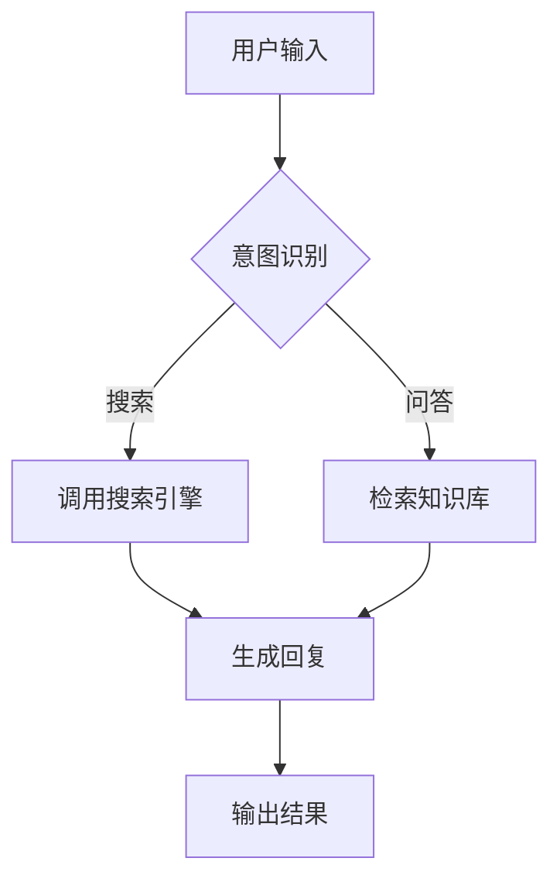
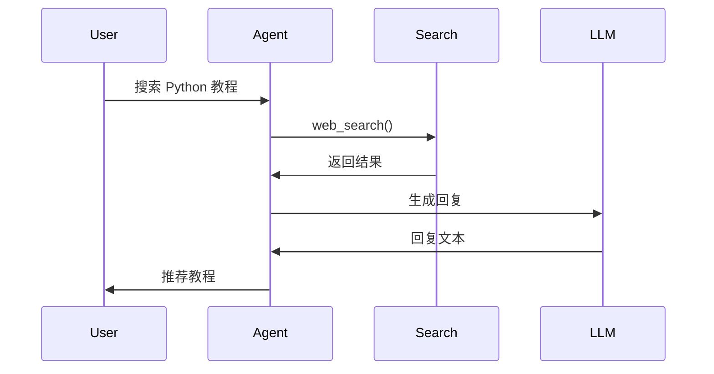

# 11 - 可视化和可观测性指南

> 让 AI Agent 的行为"看得见"，问题"可追踪"

---

## 为什么需要可观测性？

AI Agent 的非确定性系统特性要求可观测性：
- Agent 为什么做了这个决定？
- 哪个工具调用导致了错误？
- Token 到底花在哪了？

## 三大支柱

| 支柱 | 说明 | Agent 场景 |
|------|------|-----------|
| Logs（日志） | 离散事件记录 | 每一步操作 + LLM 调用 |
| Metrics（指标） | 聚合统计数据 | 调用次数、延迟、Token |
| Traces（追踪） | 端到端链路 | 一次请求的完整链路 |

## Agent 日志格式

```
[2026-07-15 10:00:01] 用户输入: "搜索 Python 教程"
[2026-07-15 10:00:02] 调用工具: web_search(query="Python 教程")
[2026-07-15 10:00:03] LLM 调用: 生成回复 (200 tokens, 1.2s)
[2026-07-15 10:00:04] 回复用户: "推荐以下 Python 教程..."
```

## Mermaid 可视化

流程图示例：



时序图示例：



## 核心指标

| 指标 | 说明 | 告警阈值 |
|------|------|----------|
| p50 响应时间 | 50% 请求完成时间 | > 10s |
| p99 响应时间 | 99% 请求完成时间 | > 30s |
| Token/请求 | 平均 Token 消耗 | > 4000 |
| 工具成功率 | 工具调用成功率 | < 95% |

## 与项目集成

| 章节 | 集成点 |
|------|--------|
| 03-Context Compression | 可视化压缩前后的 Token 节省量 |
| 04-Multi-agent | 多 Agent 的协作时序图 |
| 07-Loop/Workflow | LoopController 状态追踪的可视化 |
| 10-TUI | 作为 TUI 面板展示指标 |

---

*更新时间：2026年7月15日*
